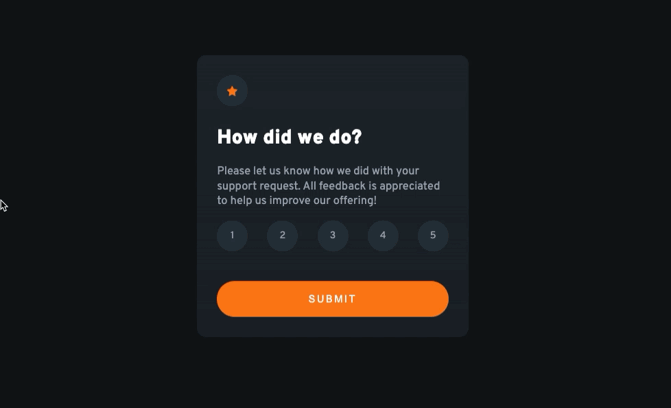

# My Interactive Rating Component Solution


Demo gif
## Table of contents

- [Overview](#overview)
  - [The challenge](#the-challenge)
  - [Links](#links)
- [My process](#my-process)
  - [Built with](#built-with)
  - [What I learned](#what-i-learned)
  - [Continued development](#continued-development)
- [Author](#author)
- [Acknowledgments](#acknowledgments)

**Note: Delete this note and update the table of contents based on what sections you keep.**

## Overview

This is my solution to the [Interactive rating component challenge on Frontend Mentor](https://www.frontendmentor.io/challenges/interactive-rating-component-koxpeBUmI). These challenges help improve coding skills by building realistic projects and giving me the opportunity to talk about my process and choices in a way that might help others but also solidfies my knowledge.

### The challenge

Users should be able to:

- View the optimal layout for the app depending on their device's screen size
- See hover states for all interactive elements on the page
- Select and submit a number rating
- See the "Thank you" card state after submitting a rating

### Links

- Solution URL: [Add solution URL here](https://www.frontendmentor.io/solutions/interactive-rating-component-styled-with-sass-r1EdVnDSq)
- Live Site URL: [Add live site URL here](https://sev-rating-component.netlify.app/)

## My process

First I looked at the figma file and came up with an html skeleton that I thought would scale well for mobile and desktop (which are very similar in this case). after a refactor or two, i came up with this.

```html
<div class="container">
  <div class="card-top"></div>
  <div class="card-bottom"></div>
</div>
```

- div.container#component
   - div.card-top

   - div.card-bottom

This simple base container will be perfect for both my form and thank you components. both exhibit the pattern of a top and bottom section that have different elements in them. I can select an individual component via its id and have them share styles and layout via the .container, since they will be the same. 

Next i focused on the rating form component

- the top of rating form has: 
  - an image which i wrapped in a div
  - a heading 
  - a paragraph
- the bottom of rating from has: 
  - an ul with 5 numbered list items
  - submit button 


the thankyou component is similar to the form
  - top: 
    - img (wrapped in a div)
    - rating confirmation in paragraph
  - bottom:
    - heading 
    - paragraph 


Once I got the structure down (more or less. hehe) I started adding styles.
I chose to challenge myself to implement Sass for the first time. 

I found a great article by Adalbert Pungu (https://www.freecodecamp.org/news/how-to-use-sass-with-css/).
The article breaks down two ways to install and configure Sass, one with node via npm and the other via Live Sass Compiler extension for VScode. 
I went with the latter because this is a small practice project and I'm just learning the basics. I will definitely be using the npm config for larger projects in the future. 

It then goes on and shows you how to get the scss file to compile to the css file. First with everything in one file and then using mixins and variables via @import. 

Once everything was set up, I started adding base styles to the body in the main scss file
I also imported the _variables, _mixins, and the _card. Variables and mixins are used throughout.

Everything is styled mobile first. 


the star image and the rating number selectors were given the same base styling because their round backgrounds are the same, the ratingBtns are given extra classes for hover and active states.

_variable colors contain a combo of hsl and hsla colors

When everthing was styled, I decided to take a break from css and work on some JS functionality. 
I broke down the functionality into smaller bits.
- rating numbers 
  - when a rating is clicked, its background is highlighted
  - when a rating is clicked, all ratings before it must also be highlighted
  - when you click a rating lower than the last rating you clicked, higher ratings go back to unhighlighted
  - when rating is clicked, a predefined variable is updated with the number that was clicked. 
- sumbit button
  - hides form component
  - shows thankyou component
  - thankyou component #user-rating p shows confirmation of rating 

  At first, I had made the rating selection buttons divs nested in a parent div. I switched them to a be an ul and li elements. I fixed it to be a little more semantic. 

  ```js
    const star1 = document.getElementById('1')
    const star2 = document.getElementById('2')
    const star3 = document.getElementById('3')
    const star4 = document.getElementById('4')
    const star5 = document.getElementById('5')
  ```

  I also had first grabbed each button individually with getElementById and added eventListeners to each of those also individually. Which ended being A LOT of extra code. 

  ```js
    star1.addEventListener('click', (e) => {
	    const el = e.target
      el.classList.add('selected')
      el.classList.remove('rating-btn:hover')
      star2.classList.remove('selected')
      star3.classList.remove('selected')
      star4.classList.remove('selected')
      star5.classList.remove('selected')
      rating = 1
    })

    star2.addEventListener('click', (e) => {
      const el = e.target
      el.classList.add('selected')
      star1.classList.add('selected')
      star3.classList.remove('selected')
      star4.classList.remove('selected')
      star5.classList.remove('selected')
      rating = 2
    })

    star3.addEventListener('click', (e) => {
      const el = e.target
      el.classList.add('selected')
      star1.classList.add('selected')
      star2.classList.add('selected')
      star4.classList.remove('selected')
      star5.classList.remove('selected')
      rating = 3
    })

    star4.addEventListener('click', (e) => {
      const el = e.target
      el.classList.add('selected')
      star1.classList.add('selected')
      star2.classList.add('selected')
      star3.classList.add('selected')
      star5.classList.remove('selected')
      rating = 4
    })

    star5.addEventListener('click', (e) => {
      const el = e.target
      el.classList.add('selected')
      star1.classList.add('selected')
      star2.classList.add('selected')
      star3.classList.add('selected')
      star4.classList.add('selected')
      rating = 5
    })  
  ```


  So on the refactor, I grabbed the ratingsBtns all at once with querySelectorAll and ran a forEach on them to add the eventListeners to each one. 

  ```js
    const ratingBtns = document.querySelectorAll('.rating-btn')
  ```
  
  Each btn when clicked, adds 'selected' class to classList and then turns ratingsBtns node list into an array, which we then use to iterate thru for the logic of highlighting or unhighlighting buttons depending on which rating was clicked.

  ```js
        ratingBtns.forEach((item, idx) => {
        item.addEventListener('click', (e) => {
        const el = e.target
        el.classList.add('selected')
        
        const btnArr = Array.from(ratingBtns)
        
        rating = el.id
        
        btnArr.forEach((btn) => {
          btn.id > el.id ? btn.classList.remove('selected')
          : btn.classList.add('selected')
          }
        })
      })

  ```


### Built with

- Semantic HTML5 markup
- CSS with SASS
- Flexbox
- Mobile-first workflow
- vanilla JavaScript

### What I learned

I learned about Array.from() which turns a node list into an array. 
This gave me a chance to practice looping through an array with forEach to change somethings. I didnt need to use .map because I didnt need it to return anything. It just created some side effects.

```js
  Array.from( nodeList )
```

I got more comfortable refactoring my javascript code from an okay solution to a better one.


### Continued development

I think down the line, when building a full project, i'd like to use this in a react project or something similar.


## Author

- Website - [Sevrinn Welker](https://sevrinn.dev/)
- Frontend Mentor - [@sevrinn](https://www.frontendmentor.io/profile/sevrinn)
- Twitter - [@sev_welker](https://www.twitter.com/sev_welker)

